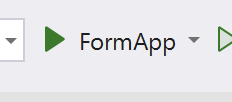
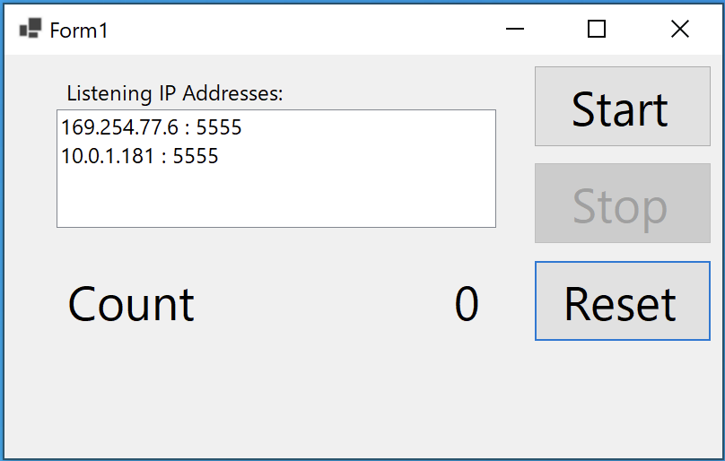
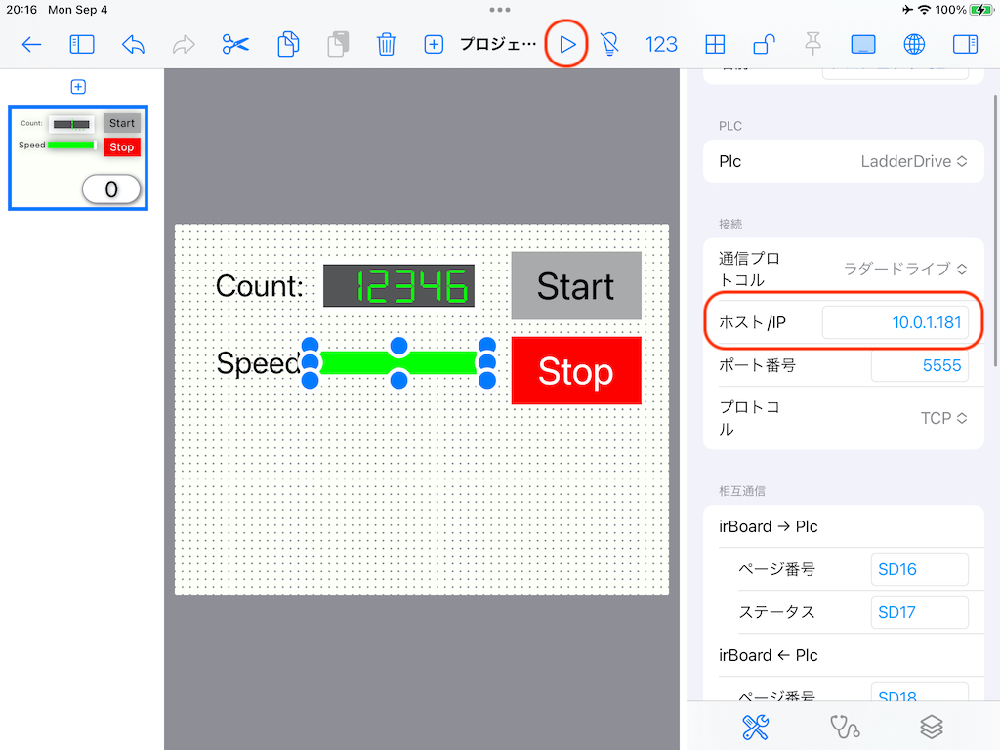
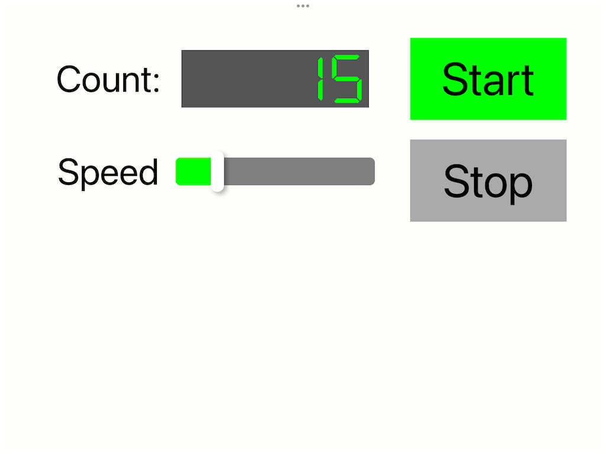

# irBoard.NET

## Purpose

This library is for connection with irBoard.  
irBoard is an iOS application. Your iOS device can be a touch panel device for FA equipment and IoT devices.  

And With irBoard.NET, you can effortlessly manage and monitor your .NET application using irBoard.

[irBoard](https://irboard.itosoft.com/)

## Uses

### Example - Monitor

- Clone or download this repository.
- Run the Monitor application in the Examples folder on a command prompt or terminal.
  ```
  cd Examples
  cd Monitor
  dotnet run
  ```
  
  Or if you can run a rake file, just do the rake command.

  ```
  rake example:monitor
  ```
- You can see a console like this.
  ```
  Listening on 192.168.1.132 : 5555
  Create an irBoard project with LadderDrive in the Iot group.
  Set the above IP address and port no to it.

  If you want to quit, input 'quit' and press the 'return' key.

  Launched a server and waiting for a connection from an irBoard ...
  $ 
  ```
- Use an irBoard sample.  
  Open [Monitor.irboard](</Examples/irboard/Monitor.irboard>) on irBoard. You should use air drop to pass a file.
- Change the IP address of irBoard's project setting from displayed in your console.
- Run the irBoard project.

[](https://www.youtube.com/watch?v=CF5ncDMtO-E)


### Example - FormApp

The FormApp demo provides a demonstration of how to use irBoard.NET within a form application.  

#### How to run

- Clone or download this repository.
- Open irboard-dotnet.sln by Microsoft Visual Studio.
- Just run the FormApp  
  
- The FormApp is able to run independently.  
  - To start counting, press the Start button.  
  - To stop counting, press the Stop button.  
  - To reset the number of counts, press the Reset button when it is Stopping.  
  
- Using irBoard you can operate or monitor this app. 
  - Open [FormApp.irboard](Examples/irboard/FormApp.irboard) on irBoard. You should use air drop to pass a file.
  - The IP addresses are shown in the FormApp.
  - Select an accessible IP address in it.
  - Set the IP address to Project config view of irBoard.
    
  - Run the project by pressing the Play button.
The irBoard will establish communication with the FormApp.
    
    - It can be used in a similar way to the FormApp.
    - In addition, you can change the count-up speed.


[](https://www.youtube.com/watch?v=0chxkpeaz3s)

## How to use irBoard.NET

After running the Monitor application, you can see the IRBoardLib.dll in Examples/Monitor/bin/Debug/net7.0.  
Import it to your .NET project.  

How to use it?  
It is very simple just like three steps.

1. Define using IRBoardLib
2. Create the IRBoard instance.
3. Just do Run().
  ```
  using IRBoardLib; // 1
  using System.Net;
  using System.Net.Sockets;

  class Program
  {
      static void Main(string[] args)
      {
          IRBoard irboard = new IRBoard();  // 2
          irboard.Run();                    // 3

  ```
4. Accessing data, to use acessor methods of IRBoard class.
    - Read:
        - bool BoolValueOf(string device)
        - UInt32 UInt32ValueOf(string device)
        - Int32 Int32ValueOf(string device)
        - UInt16 UInt16ValueOf(string device)
        - Int16 Int16ValueOf(string device)
        - float FloatValueOf(string device)
        - string StringValueOf(string device, int length = 0)
    - Write:
        - void SetBoolValueTo(bool value, string device)
        - void SetUInt32ValueTo(UInt32 value, string device)
        - void SetInt32ValueTo(Int32 value, string device)
        - void SetUInt16ValueTo(UInt16 value, string device)
        - void SetInt16ValueTo(Int16 value, string device)
        - void SetFloatValueTo(float value, string device)
        - void SetStringValueTo(string str, string device, int length = 0)
5. You can receive notifications for changes through an event.
  ```
        private void Form1_Load(object sender, EventArgs e)
        {
            irboard.OnChanged += Irboard_OnChanged;
        }

        private void Irboard_OnChanged(object? sender, IRBoardEventArgs e)
        {
            // If it's called from this, there's nothing to be done.
            if (this.InvokeRequired == false) { return; }

            // IRBoard invokes this function from the listening thread.
            // Please ensure that all actions are performed within the Invoke() block.

            this.Invoke(
                new Action(() =>
                {
                    switch (e.DeviceName)
                    {
                        case "D0":
                            UpdateCount();
                            break;

                        // Speed variables use two words, D2 and D3.
                        // When you read Speed at notified with D2, the value of D3 is not yet reflected, 
                        // which may cause incorrect speed results.
                        // To prevent this, read it notified with D3 (last word).
                        case "D3":
                            UpdateSpeed();
                            break;
                        case "M0":
                            if (exRunning != Running)
                            {
                                if (Running)
                                {
                                    Start();
                                }
                                else
                                {
                                    Stop();
                                }
                            }
                            break;
                        default:
                            break;
                    }
                })
            );
  ```


## Devices

LadderDrive support these devices.  
Combine Prefix and Number. 
  e.g., X0, M1, D2

### Bit devices 

X and Y should be used numbers as hex.
  e.g., X0, X1, ....XA, XB, ... XF, X10, ....

|Prefix|From|To|Purpose|Note|
|:-:|--:|--:|:--|:--|
|X|0|3ff|Input bit device, like a switch.|Hex|
|Y|0|3ff|Output bit device, like a lamp.|Hex|
|M|0|1023|General uses bit device.||
|L|0|1023|Latch bit device. <br />But it's the same as M devices in irBoard.NET||
|SC|0|1023|System bit device. <br />It's used for interaction with irBoard. ||


### Word(UInt16) devices

|Prefix|From|To|Purpose|Note|
|:-:|--:|--:|:--|:--|
|D|0|1023|Data memory device.||
|SD|0|1023|System word device. <br />It's used for interaction with irBoard. ||

All word devices are expressed UInt16 value internally.
Using accessor methods, you can get various data types.

If you use DWord size type (UInt32, Int32, Float), it uses the next device of the specified device. 

```
// It generates UInt32 value form D0(lower byte) and D1 (higher byte)
var val = UInt32ValueOf("D0");
```

```
// It generates string value form D0(lower byte) and until funded the termination (null). 
// It is very dangerous. Because it uses whole memory if the termination is missing.
var val = StringValueOf("D0");

// For safety, use it with length (byte size). It uses a maximum half of the length.
var val = StringValueOf("D0", 32); // D0 to D15
```

